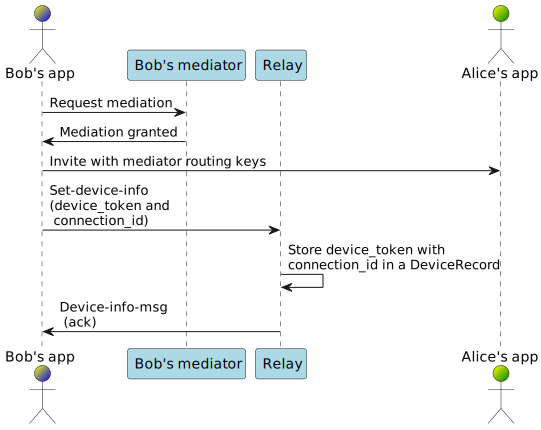

Firebase Push Notification Plugin
=======================================

The Firebase Push Notification Plugin allows push notifications to be sent to mobile devices from [Aries-Cloud-Agent Python](https://github.com/hyperledger/aries-cloudagent-python) using [Firebase Cloud Messaging](https://firebase.google.com/docs/cloud-messaging). This means that the message receiver can be notified when their mediator has received an undeliverable message.

This project is inspired by [Aries RFC 0734: Push Notifications fcm Protocol 1.0](https://github.com/blu3beri/aries-rfcs/tree/feat/push-notifications-android/features/0734-push-notifications-fcm) from Timo Glastra & Berend Sliedrecht (Animo Solutions).

The push notification plugin functions in conjunction with the [pickup plugin](https://github.com/Indicio-tech/acapy-plugin-pickup), which allows an agent to pick up messages held by a mediator.

## Development/Manual Setup

1. Clone this repository

2. Create your Firebase Console by clicking **Add Project** on [this page](https://console.firebase.google.com/)

3. Download mobile app

4. Copy your firebase server token and your device token into your local copy of this repository as environment variables

    a. Create a `.env` file in the `demo/` folder

    b. Find the server token on the Firebase Console under Settings > Project Settings > Cloud Messaging > Cloud Messaging API > Server key. Paste this value into `.env` file as the `FIREBASE_SERVER_TOKEN` environment variable

    c. Find the `device_token` in the mobile app and paste it into the `.env` file as the `DEVICE_TOKEN` environment variable

.env:
```
DEVICE_TOKEN="cYHSGX..."
FIREBASE_SERVER_TOKEN="AAAA9g..."
```


## Overview
* Alice: message sender
* Bob: message receiver (has a mobile app that allows for receiving push notifications)
* Mediator: an ACA-Py plugin that extends mediator functionality to include a `device_token` registry. The mediator is loaded with the relay and pickup plugin and belongs to the message receiver so that it can forward undelivered messages to firebase
  * Relay: a service that forwards messages
  * Pickup: a plugin that helps an agent pick up messages held by a mediator
* [Firebase Console](https://console.firebase.google.com/): Google platform with feature for sending push notifications


After Bob has established a connection with his mediator and requested mediation, he can then register his device for any messages that arrive at the mediator for his connection. If Bob's device is offline, then the mediator loaded with the relay will send a push notification for the message.

To register his device, Bob sends the `set-device-info` message to his mediator loaded with the relay. The relay stores the `device_token` with the `connection_id` corresponding to Bob's connection to his mediator. Bob receives the `device-info` message in acknowledgement.

When Bob's mediator receives a message from Alice but Bob's device is unavailable, the undeliverable message event is raised, triggering the push notification to be sent via the relay. The pickup plugin triggers the undelivered messages to be sent to Bob's device.


## Name and Version
URI: `https://didcomm.org/push-notifications-fcm/1.0`

Protocol Identifier: `push-notifications-fcm`

Version: `1.0`


## Registering a Device Token

#### Set Device Info
When a notification receiver wants to receive notifications of undeliverable messages from a mediator, they can register a new device token using the `set-device-info` message over the mediated connection. The `set-device-info` message below registers, updates, or removes the device token from the mediator. To stop receiving push notifications, the notification receiver can send the above message where ALL values are null.

```
{
  "@type": "https://didcomm.org/push-notifications-fcm/1.0/set-device-info",
  "@id": "<UUID>",
  "device_token": "<DEVICE_TOKEN>"
}
```
* `device_token` -- The token that is required by the notification provider (string, null)


#### Get Device Info
When a notification receiver wants to get their push-notification configuration, they can send the following message:
```
{
  "@type": "https://didcomm.org/push-notifications-fcm/1.0/get-device-info",
  "@id": "<UUID>"
}
```

#### Device Info
Response to the `get-device-info` message:
```
{
  "@type": "https://didcomm.org/push-notifications-fcm/1.0/device-info",
  "device_token": "<DEVICE_TOKEN>",
  "~thread": {
    "thid": "<GET_DEVICE_INFO_UUID>"
  }
}
```

### Message Flow

1. Bob requests mediation from his mediator
2. Mediator grants mediation to Bob
3. Bob sends an invite to Alice containing routing keys registered with Bob's mediator. (Bob will only receive notifications about messages with public keys registered with mediator.)
4. Bob sends the `set-device-info` message with `device_token` and `connection_id` of mediated connection to the relay
5. Relay stores `device_token` with `connection_id` in a `DeviceRecord`
6. Relay sends `device-info` message to Bob in acknowledgement




## Sending a Push Notification

The push notification is an unencrypted data payload sent to the firebase console to be received as a notification on mobile device.

#### Push Notification
```
{
  "@type": "https://didcomm.org/push-notifications-fcm/1.0/push-notification",
  "message_id": "<MESSAGE_ID>",
  "message_tag": "<MESSAGE_TAG>",
  "recipient_key": "<RECIPIENT_KEY>",
  "priority": "<PRIORITY>",
}
```

* `message_id` - Optional field to pickup the message from the mediator that the notification was linked to
* `message_tag` - Optional field to connect the push notification to a DIDcomm message
* `recipient_key` - Optional field for recipient key
* `priority` - Optional field for priority of message

### Message Flow


1. Alice sends a message to Bob's mediator using the public keys Bob has registered with his mediator
2. The mediator attempts to deliver message referring to registered keys
3. The undeliverable message event is raised
4. The pickup plugin queues the message on failed delivery
5. Relay looks up `device_token` from `connection_id` on undeliverable event
6. Relay notifies Firebase Console
7. Bob's mobile app retrieves `PushNotification` from Firebase Console
8. When Bob's device is back online, the pickup protocol flow begins to allow the mobile app to receive all messages queued in the mediator


### Future Work
* Enable dynamic registration
* Support multiple mediators